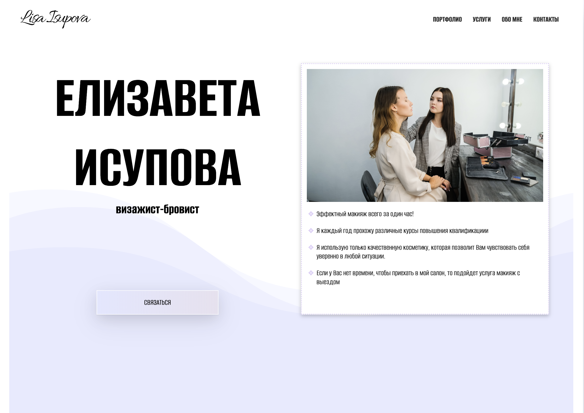
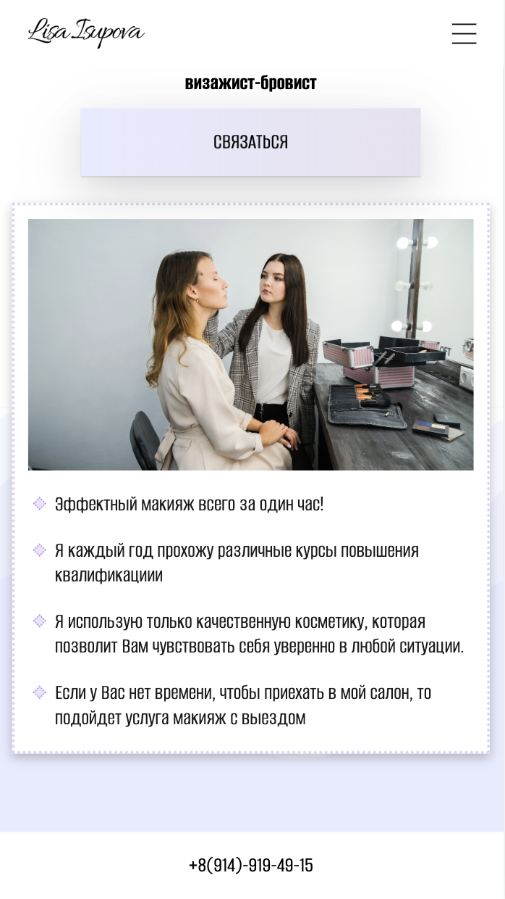
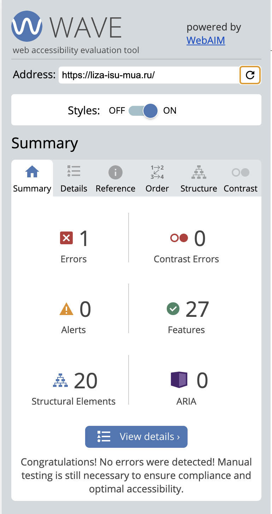
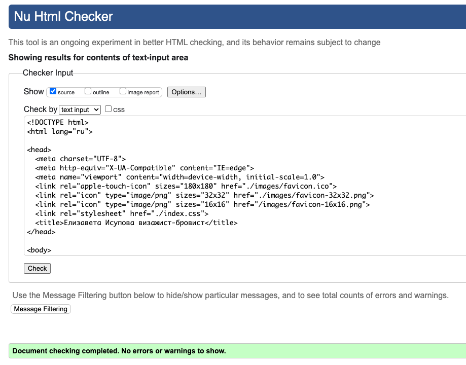
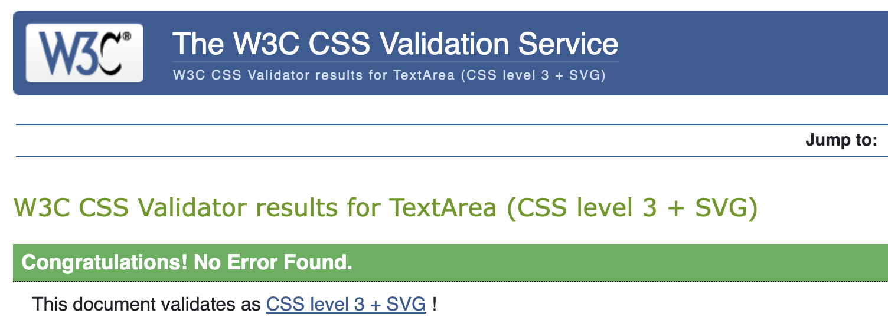
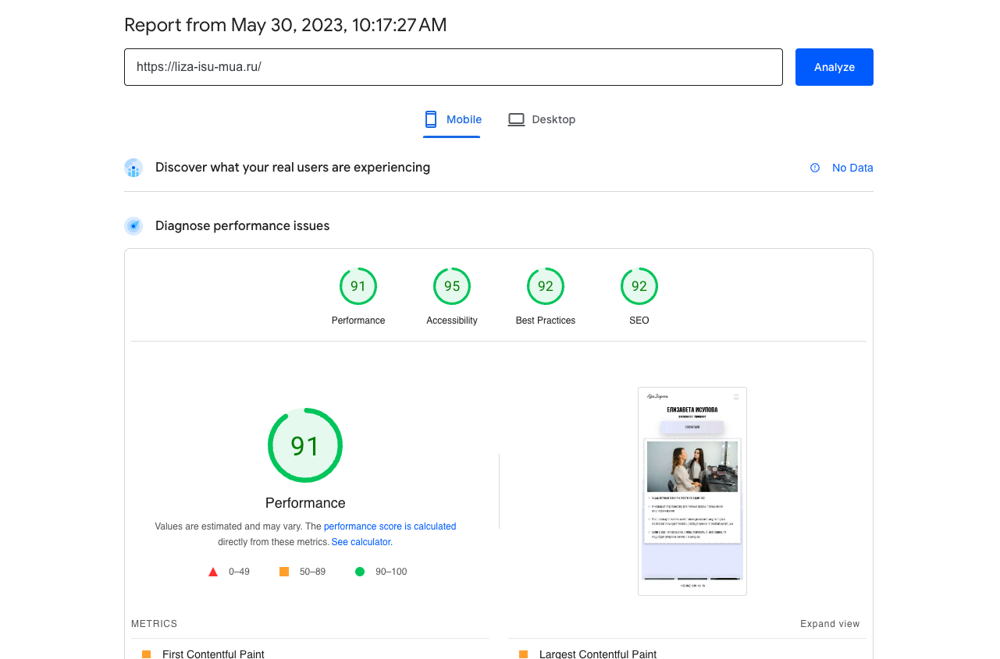

# Landing-page-makeup

Одностраничный сайт для визажиста
[Посмотреть](https://liza-isu-mua.ru/)

## Техническое задание: 

Разработать дизайн и создать адаптивный одностраничный сайт для визажиста с нежным и элегантным стилем и нестандартной галлерей. Основные разделы:
* Главная страница
* Галлерея
* Сертификаты
* Услуги
* Часто задаваемые вопросы
* Контакты

## Использованныe технологии:
* HTML
* CSS
* JS

| Desktop | Mobile |
|-------------|-------------|
|||

## Реализовано:
*  Стильный и нежный дизайн, которым доволен клиент
*  Адаптивность под все типы устройств (desktop и mobile)
*  Сайт проверен через онлайн валидаторы
*  Реализованы попапы для галлереи и сертификатов
*  Сделано меню-бургер
*  Сайт соответствует стандарту доступности
*  Подобран домен и сайт размещен на хостинге
  
| Accessibility| Validation HTML |Form validation |
|-------------|-------------|-------------|
||||

## Результаты скорости загрузки и оптимизации сайта:

